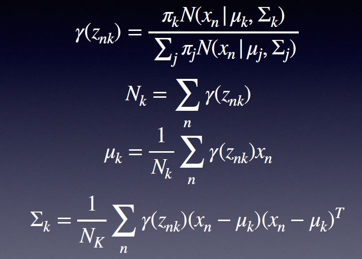

## 2019.05.19 - Clustering & Dimension Reduce
## Clustering : 分集合 
###  K-means算法 , $r_{nk}=1, \quad  if x_n \in k $ =>数据本身分类
+ 旧 miu 算 新 r , 新 r 算 新 miu
+ 旧miu算新r : 划分到最近的集合
+ 新r算新miu : 选所有的中心点

推广 : 定义内积, 任何东西都可以, 但miu怎么求呢? --> 取miu为集合里的元素   

例子：image　segmentation、data compression

### EM算法 (超重要)
Coin question (Discrete)
Define latent variable $z$ , indicate the result
+ Find z given which (and P1 and P2) the result is the most probable(MLE)(M step)
+ Calculate P1 and P2 using the new z(E step)

Gauss distribution

+ culate gamma(E step)
+ Calculate mu, sigma and pi

## DR : 降维

### PCA算法 (embedding) =>找特征
+ Maximum variance formulation (好区分) 
+ Minimum error formulation
The above two methods are equivalent

### PPCA 和 PCA 的 motivation ?
+ 算特征值的复杂度 : O(n^3)
+ 当有些维数不全时 ? (比如:图像被遮盖)
+ PPCA : 不确定性

### 程序员(码侬) vs 做AI的人(develop 模型)
+ AI的程序简单, 关键点在数学 (优化算法?)

### 问问why ? (方法特点、何时适用)
+ This week - unsupervised learning : clustering, dr
+ 样本数量 、空间维数、 特征维数、 线性、 非线性
+ 基本思想很重要
